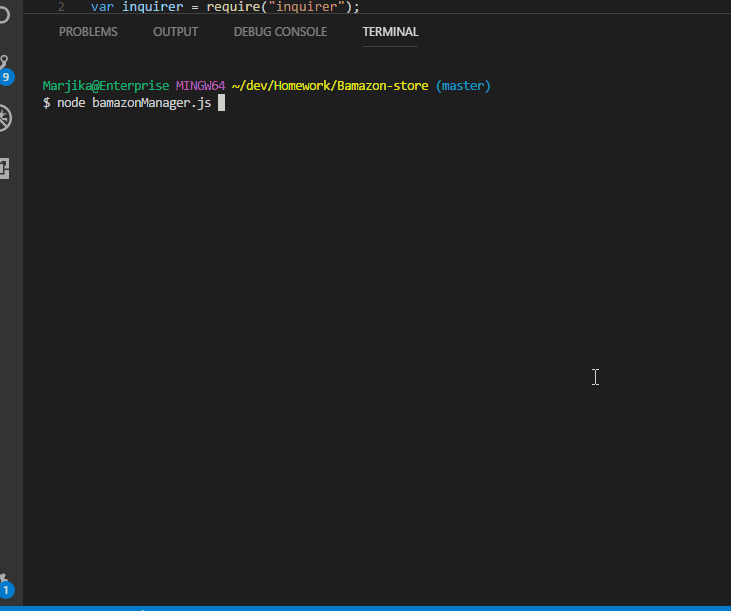
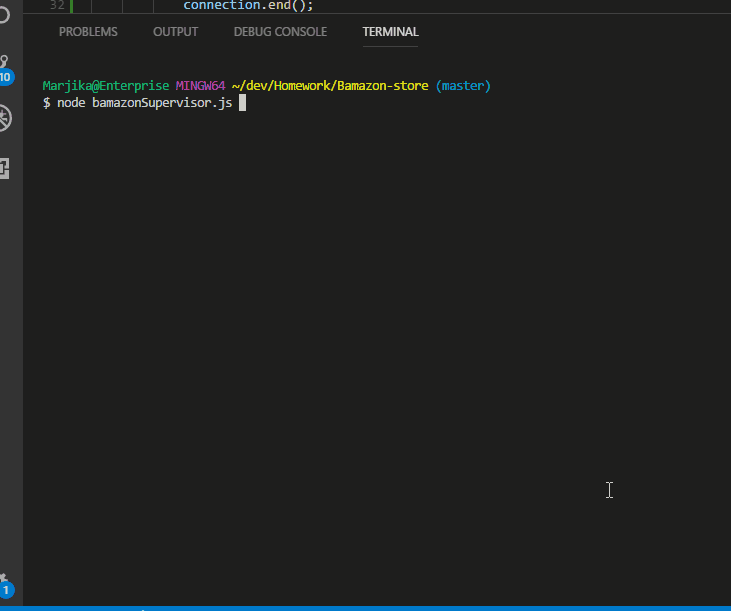

# Bamazon-store
MySQL and node program storefront
This is a Nodejs application with 3 types of functionality, each of which communicates with a mysql database, that holds items in an online store. This application uses inquirer and mysql npm packages.  For the customer functions (bamazonCustomer.js), the user sees a list of items available in the store. The user can choose an item and a quantity, and the application updates (depletes) the purchased items in the database and gives a total to the customer.  The program then updates the total sales, which is an amount used in the supervisor file.

#### Bamazon Customer

#### Bamazon Manager

For the manager functions (bamazonManager.js), the manager is given four options, "View Products for Sale", "View Low Inventory" (a list of products with less than 5 units in stock), "Add to Inventory" (the item amounts can be replenished/updated), and "Add New Product".  Once again, these items are updated in the database through the use of mysql npm package to connect with the database.

#### Bamazon Supervisor

In the supervisor functions (bamazonSupervisor.js), the supervisor is given two options, "View Product Sales by Department", which queries the database through mysql node module and displays department id, name, overhead costs, product sales (generated from customer purchases), and total profit (based on product sales minus overhead costs), and "Create New Department", which allows the supervisor to input a new department and its overhead costs.  This file also uses the table npm package to neatly display the information for the supervisor/user.

##### About this Application

This repository is for a Javascript application using Node, containing Javascript files and .json files. It is meant to be run in NODE, not on a hosted site.
The application allows the user interact with store inventory as a customer (purchasing), manager (adding new products, etc.) and as a supervisor (costs and sales by department). This project was created and is maintained by me, Marjika Howarth.
